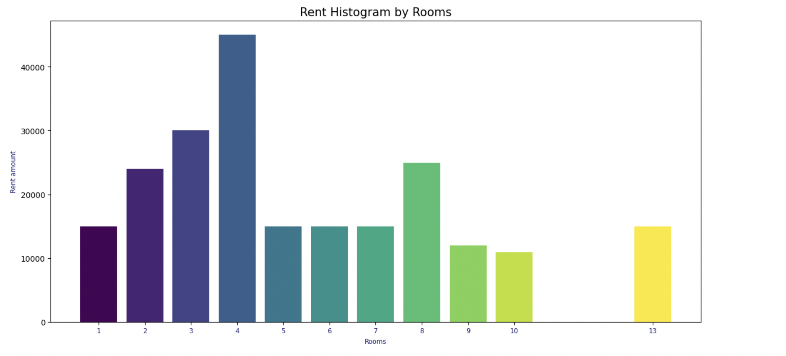
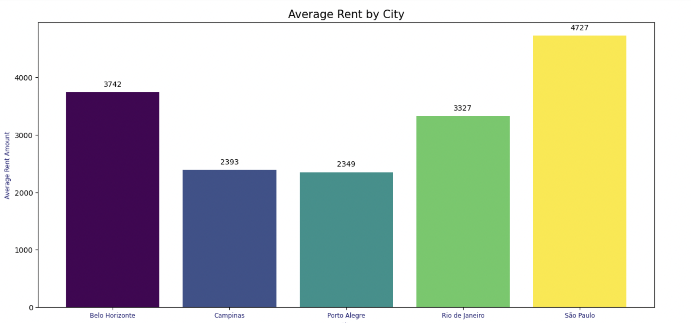
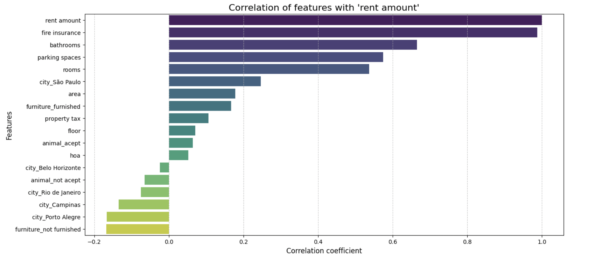

# Regression models: Rent in Brazil

# Модель прогнозування вартості оренди в Бразилії

Цей проєкт розроблено для визначення вартості оренди в Бразилії. Інтерактивний інтерфейс створений на основі [**Streamlit**](https://rent-brazil1.streamlit.app/), що дозволяє легко взаємодіяти з моделлю та аналізувати результати.


## Опис

**1. Мета проєкту:** створити аналітичний інструмент для дослідження вартості ренти в Бразилії, що включає різні фактори, в тому числі регіони.

**2. Завдання проєкту:**

- **аналіз даних:** визначити ключові фактори, що впливають на вартість;
- **побудова моделей:** використовуючи методи машинного навчання та статистичні аналізи, створити модель, яка зможе прогнозувати вартість ренти;
- **iнтерфейс користувача:** розробити інтерактивний інтерфейс, що дозволить користувачам вводити нові дані, аналізувати результати та робити прогнози на основі моделі.

## Технології

**Проєкт реалізовано з використанням таких технологій:**

- **Python**: основна мова програмування;
- **Docker Compose**: для спрощення процесу розгортання та управління проєктом у середовищі Docker.

## Бібліотеки

- **Pandas**: для обробки даних;
- **Numpy**: для числових обчислень;
- **Scikit-learn**: для побудови та оцінки моделей машинного навчання;
- **Matplotlib** та **Seaborn**: для візуалізації даних;
- **Streamlit**: для створення інтерактивного інтерфейсу;
- **Joblib**: для ефективного серіалізування (збереження) та завантаження об'єктів Python.

## Dataset

**Для цього проєкту використовувався набір даних із такими характеристиками:**

- **https://www.kaggle.com/datasets/iamsouravbanerjee/house-rent-prediction-dataset**
- формат: `.csv`;
- містить такі ключові стовпці: `city`, `rent amount `, `bill_avg`, `parking spaces`, тощо.

Цей набір даних містить 10692 об'єкти оренди з 13 різними характеристиками:

- **city**: місто, в якому знаходиться об'єкт;
- **area**: площа об'єкта нерухомості;
- **rooms**: кількість кімнат;
- **bathroom**: кількість ванних кімнат;
- **parking spaces**: кількість паркувальних місць;
- **floor**: поверх;
- **animals**: дозвіл на проживання з тваринами;
- **furniture**: меблі;
- **hoa (R$)**: податок на асоціацію власників житла;
- **rent amount (R$)**: розмір орендної плати;
- **property tax**: податок на муніципальне майно;
- **fire insurance (R$)**: вартість страхування від пожежі;
- **total (R$)**: загальна сума всіх значень.

## Вартість оренди в залежності від кількості кімнат



## Вартість оренди в залежності від міста



✅ **_У Сан-Паулу середня вартість оренди житла вища, ніж в інших містах._**

**_І це не дивно, адже він є центром великої агломерації з населенням 23 мільйони, також однієї з найбільших у світі._**

## Кореляційний аналіз для розміру орендної плати



**_Висновки кореляційного аналізу для розміру орендної плати:_**

**_Сильний позитивний зв'язок_**: змінні, які мають сильну позитивну кореляцію з розміром орендної плати, мають прямий зв'язок. Тобто, коли значення цих змінних зростає, орендна плата також зростає.

- **fire insurance (0,987)**: дуже сильна кореляція з розміром орендної плати. Це очікувано, оскільки сума страховки може бути пропорційною до орендної плати.

- **bathrooms(0,666)**: наявність більшої кількості ванних кімнат асоціюється з вищою орендною платою. Це вказує на те, що житло з більшою кількістю зручностей коштує дорожче.

- **parking spaces (0,574)**: житло з паркувальними місцями має вищу орендну плату, оскільки це часто є ознакою розкоші або зручності.

- **rooms (0,537)**: більша кількість кімнат також асоціюється з вищою орендною платою, що відповідає логіці більших площ.

- **City São Paulo (0,25)**: розташування сильно впливає на вищі орендні ставки.

**_Слабкий позитивний зв'язок_**:

- **area (0,178)**: площа має помірну позитивну кореляцію, але не є ключовим фактором. Це може свідчити про те, що більша площа не завжди означає значно вищу орендну плату.

- **property tax(0,107)**: податок на нерухомість має слабкий вплив. Він, ймовірно, враховується власниками нерухомості, але не є прямим індикатором орендної плати.

**_Майже нейтральний вплив:_**.

- **floor (0,071)**: поверх має дуже слабкий вплив на орендну плату, що може залежати від міста та архітектури будинків.

- **(animal accept0,06)**: Незначний вплив на рівень орендної плати.

- **hoa (0,052)**: невеликий зв'язок із внесками hoa. Це може впливати лише на певні типи житла (наприклад, квартири в hoa (ОСББ)).

**_Негативна кореляція_**: змінні з від'ємною кореляцією мають обернений зв'язок, тобто, коли значення змінної збільшується, орендна плата зменшується.

**animal_not_accept (-0,06)**: у приміщеннях, де тварини не допускаються, орендна плата є дещо нижчою.

- **furniture_not furnished (-0,17)**: демонструють обернений зв'язок, можливо, через вподобання орендарів.

Міста, наприклад, city_Belo Horizonte, city_Campinas: у містах з негативною кореляцією з розміром орендної плати орендні ставки можуть бути нижчими порівняно з базовими містами (наприклад, city_São Paulo).

# **_Загальний висновок:_**

Орендна плата в першу чергу залежить від ключових характеристик нерухомості (ванні кімнати, парковка, кімнати), місця розташування (Сан-Паулу) та додаткових витрат (страхування). Інші фактори, такі як меблювання та політика щодо домашніх тварин, мають слабший вплив, але все ще є важливими для цільового аналізу.

## Модель

- в проекті було випробувано такі моделі як: **LinearRegression; Linear regression with Lasso, Ridge, ElasticNet regularization; SVR, RandomForestRegressor**;

- для підбору найкращих гіперпараметрів використовувався: GridSearchCV.

# Порівняння моделей:

| Model                                                         | MAE        | MSE          | RMSE        | R2       |
| ------------------------------------------------------------- | ---------- | ------------ | ----------- | -------- |
| **Linear Regression (Train)**                                 | 296.182627 | 2.156508e+05 | 464.382169  | 0.981444 |
| **Linear Regression (Test)**                                  | 321.153450 | 6.703823e+05 | 818.768761  | 0.946516 |
| **Linear regression with Lasso regularization (Train)**       | 293.663125 | 2.247485e+05 | 474.076464  | 0.980661 |
| **Linear regression with Lasso regularization (Test)**        | 315.717036 | 3.939180e+05 | 627.628853  | 0.968573 |
| **SVR (Train)**                                               | 284.258514 | 1.639049e+06 | 1280.253446 | 0.858968 |
| **SVR (Test)**                                                | 291.741362 | 4.293574e+05 | 655.253668  | 0.965745 |
| **Random Forest Regressor (Train)**                           | 123.370415 | 5.525399e+04 | 235.061670  | 0.995246 |
| **Random Forest Regressor (Test)**                            | 342.022606 | 9.401107e+05 | 969.593048  | 0.924996 |
| **Linear regression with Ridge regularization (Train)**       | 296.434150 | 2.156853e+05 | 464.419328  | 0.981441 |
| **Linear regression with Ridge regularization (Test)**        | 321.891060 | 6.876466e+05 | 829.244573  | 0.945138 |
| **Linear regression with Elastic Net regularization (Train)** | 294.810219 | 2.231826e+05 | 472.422034  | 0.980796 |
| **Linear regression with Elastic Net regularization (Test)**  | 294.810219 | 2.231826e+05 | 472.422034  | 0.980796 |

# **_Порівняння та висновки_**

Оцінка моделей базується на кількох метриках: MAE (Mean Absolute Error), MSE (Mean Squared Error), RMSE (Root Mean Squared Error), і R² (коефіцієнт детермінації). Кращу модель можна вибрати залежно від цілей аналізу, але загалом нижчі помилки (MAE, MSE, RMSE) та вищий R² свідчать про кращу модель.

❎ **_Найкраща модель:_**

**Найкраща модель: Linear regression with Elastic Net regularization**. Чому:

Високий R² на тренувальних (0.9808) і тестових (0.9808) даних.
Найнижчий RMSE на тестових даних (472.42), що вказує на найкраще узгодження з реальними значеннями.

Elastic Net збалансовує регуляризацію, уникаючи переобчислення.
**Альтернативна модель: Linear regression with Lasso regularization**. Чому:
Другий найкращий R² на тестових даних (0.9686).
Низький RMSE (627.63), що також свідчить про добру узгодженість.
Менш чутлива до колінеарності, ніж проста лінійна регресія.

⭕ **_Найгірша модель:_**

Random Forest Regressor надмірно підганяє навчальні дані, що призводить до найвищих помилок при тестуванні та зниженої узагальнюваності. Він може потребувати налаштування гіперпараметрів для покращення своєї продуктивності.

## Запуск локально

1. **Клонування репозиторію:**

```
git clone https://github.com/MariiaSam/Rent-in-Brazil.git
cd Rent-in-Brazil
```

2. **Налаштування середовища за допомогою Poetry:**

Встановіть залежності проєкту:

```
poetry install
```

Для активації віртуального середовища необхідно виконати команду:

```
poetry shell
```

Щоб додати до проекту залежність, необхідно виконати команду

```
poetry add <назва_пакету>
```

Для підтягування існуючих залежностей:

```
poetry install
```

# Використання

Запустіть Streamlit-додаток командою:

```
streamlit run app.py
```

# Docker

Цей проєкт також підтримує Docker-контейнеризацію, що дозволяє легко запускати додаток без необхідності налаштовувати середовище вручну.

**1. Запуск проекту через Docker**

Використовуйте команду для запуску контейнера на основі вашого Docker Image:

```
docker run --rm -d -p 8880:8880 rentinbrazil:latest
```

--rm — автоматично видаляє контейнер після зупинки;

-d — запускає контейнер у фоновому режимі;

-p 8880:8880 — відображає порт 8880 на локальній машині для доступу до додатку.

**2. Доступ до додатку:**

Після запуску контейнера, додаток буде доступний за адресою:

```
http://localhost:8880
```

3. **Зупинка проекту:**

Щоб зупинити проект, виконайте:

```
docker ps
```

Потім використовуйте команду для зупинки контейнера:

```
docker stop <container_id>
```

Де <container_id> — це ідентифікатор вашого контейнера, отриманий із команди docker ps.
